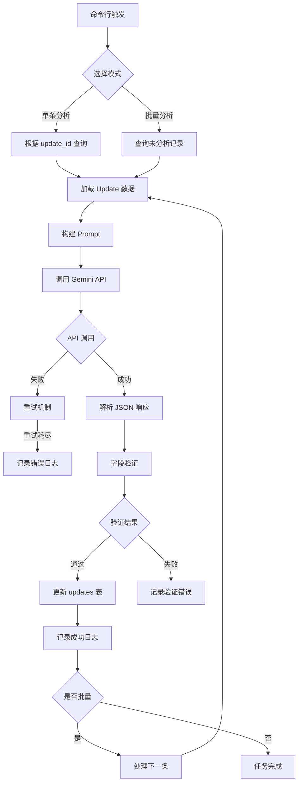
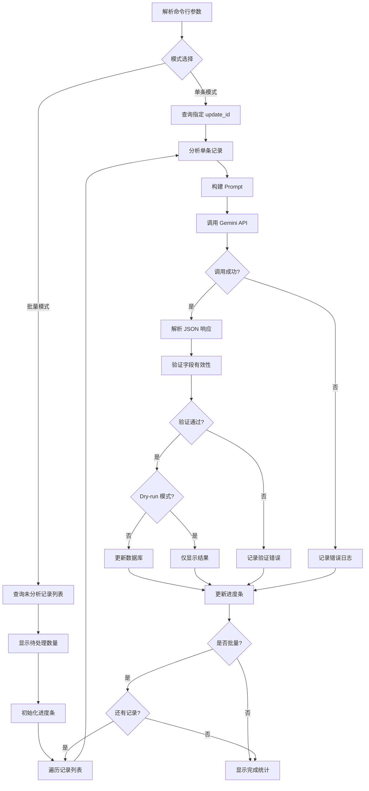

# AI 分析功能设计文档

## 一、功能概述

为云计算竞争情报系统添加 AI 分析能力，通过 Gemini 模型对爬取的更新内容进行智能分析，生成翻译标题、结构化摘要、分类标签等字段，提升数据的可读性和价值密度。

### 核心目标

- 实现单条更新记录的 AI 分析功能
- 支持批量分析未处理的更新记录
- 将分析结果直接写入 SQLite 数据库的 updates 表
- 通过 `run.sh` 脚本提供统一的命令行入口

### 分析范围

本次设计仅涵盖 Phase 1 基础能力，包括：
- 标题翻译与优化（title_translated）
- 结构化内容摘要（content_summary）
- 更新类型分类（update_type）
- 产品子类判定（product_subcategory）
- 关键词提取（tags）

---

## 二、系统架构设计

### 2.1 目录结构调整

```
cnetspy/
├── src/
│   ├── analyzers/                 # 新增：AI 分析模块
│   │   ├── __init__.py
│   │   ├── base_analyzer.py       # 分析器基类
│   │   ├── gemini_client.py       # Gemini API 客户端封装
│   │   ├── update_analyzer.py     # 单条更新分析器
│   │   └── prompt_templates.py    # Prompt 模板管理
│   │
│   ├── crawlers/                  # 现有：爬虫模块
│   ├── models/                    # 现有：数据模型
│   ├── storage/                   # 现有：存储层
│   └── utils/                     # 现有：工具层
│
├── scripts/
│   └── analyze_updates.py         # 新增：分析脚本入口
│
├── config/
│   └── ai_model.yaml              # 新增：AI 模型配置
│
└── run.sh                          # 扩展：添加 analyze 命令
```

### 2.2 模块职责划分

| 模块 | 职责 | 核心组件 |
|------|------|---------|
| **analyzers/** | AI 分析核心逻辑 | Gemini 客户端、Prompt 模板、分析器 |
| **scripts/analyze_updates.py** | 命令行入口 | 参数解析、批量任务调度、进度展示 |
| **config/ai_model.yaml** | AI 配置管理 | 模型参数、速率限制、Prompt 版本 |
| **storage/database/** | 数据持久化 | 分析结果写入 updates 表 |

---

## 三、数据流设计

### 3.1 分析流程



### 3.2 批量处理策略

| 策略项 | 设计方案 |
|--------|---------|
| **查询条件** | 查询 `title_translated IS NULL` 且 `content` 不为空的记录 |
| **并发控制** | 单线程顺序处理，避免 API 速率限制 |
| **进度展示** | 实时显示 `已处理/总数` 和成功率 |
| **失败处理** | 单条失败不中断流程，记录到日志文件 |
| **速率限制** | 根据 `config/ai_model.yaml` 配置的间隔控制调用频率 |

---

## 四、AI 分析字段规范

### 4.1 字段输入输出映射

| 字段名 | 数据来源 | 生成方式 | 输出格式 | 存储字段 |
|--------|---------|---------|---------|---------|
| **title_translated** | `content` + `title` | AI 理解内容后提取核心标题并翻译 | 中文字符串（≤50字） | `updates.title_translated` |
| **content_summary** | `content` | AI 生成结构化 Markdown 摘要 | Markdown 格式（150-300字） | `updates.content_summary` |
| **update_type** | `content` + `source_channel` | AI 从枚举中选择最匹配的类型 | UpdateType 枚举值 | `updates.update_type` |
| **product_subcategory** | `content` + `product_name` | AI 动态判定产品子类 | 小写英文+下划线（如 `peering`） | `updates.product_subcategory` |
| **tags** | `content` + `title` | AI 提取关键词 | JSON 数组（3-8个关键词） | `updates.tags` |

### 4.2 title_translated 生成规则

**处理逻辑：**
1. 不直接翻译原始 `title`
2. 结合 `content` 语境理解更新的核心价值
3. 从内容中提取最能概括更新的英文标题
4. 将提取的标题翻译为中文

**输出要求：**
- 简洁明了，不超过 50 个字
- 体现更新的核心内容和价值
- 避免模糊表达（如"新功能上线"），突出具体内容
- 使用专业术语但保持可读性

**示例：**
| 原始 title | content 关键信息 | title_translated |
|-----------|-----------------|------------------|
| New Feature Release | VPC 支持 IPv6 双栈网络 | VPC 新增 IPv6 双栈网络支持 |
| Update Announcement | Lambda 函数冷启动时间减少 50% | Lambda 函数冷启动性能提升 50% |

### 4.3 content_summary 格式规范

**固定输出模板：**

```markdown
## 更新概要
{1-2句话概括更新核心内容}

## 主要内容
- {要点1}
- {要点2}
- {要点3}

## 影响范围
{适用场景或影响的用户/服务}

## 相关产品
{涉及的云产品名称}
```

**输出要求：**
- 总字数控制在 150-300 字
- 使用 Markdown 格式
- 主要内容不超过 5 条要点
- 突出核心价值，避免冗余信息
- 语言简洁专业

### 4.4 update_type 分类规则

**输入维度：**
- `content`：更新的具体内容描述
- `source_channel`：数据源类型（blog / whatsnew）

**枚举选项（UpdateType）：**

| 枚举值 | 说明 | 判断依据 |
|--------|------|----------|
| `new_product` | 新产品发布 | 全新产品/服务上线 |
| `new_feature` | 新功能发布 | 现有产品新增功能 |
| `enhancement` | 功能增强 | 现有功能优化升级 |
| `deprecation` | 功能弃用 | 功能下线/弃用通知 |
| `pricing` | 定价调整 | 价格变化相关 |
| `region` | 区域扩展 | 新区域/可用区上线 |
| `security` | 安全更新 | 安全补丁/增强 |
| `fix` | 问题修复 | Bug 修复 |
| `performance` | 性能优化 | 性能提升相关 |
| `compliance` | 合规认证 | 合规/认证相关 |
| `integration` | 集成能力 | 第三方集成/API 更新 |
| `other` | 其他 | 无法归类时选择 |

**选择策略：**
- AI 需结合内容语义综合判断
- 优先选择最具体的类型
- 当存在多种特征时，选择最主要的特征
- 不确定时选择 `other`

### 4.5 product_subcategory 判定规则

**判定逻辑：**
- 结合 `content` 和 `product_name` 进行语义分析
- 输出简洁的子类名称（英文小写+下划线）
- 不使用预定义枚举，允许 AI 动态判定
- 对于无法确定子类的情况，输出空字符串

**判定示例：**

| product_category | product_name | content 特征 | product_subcategory |
|-----------------|--------------|-------------|---------------------|
| VPC | Virtual Private Cloud | VPC 对等连接配置 | `peering` |
| VPC | Virtual Private Cloud | 私网端点服务 | `private_link` |
| Load Balancing | Application Load Balancer | 应用层负载均衡 | `alb` |
| CDN | Content Delivery Network | 边缘缓存策略 | `edge_cache` |

### 4.6 tags 提取规则

**输出格式：**
```json
["VPC", "网络安全", "IPv6", "多可用区"]
```

**提取规则：**
- 提取 3-8 个关键词
- 优先提取：产品名称、技术特性、业务场景
- 支持中英文混合
- 避免过于宽泛的词汇（如"更新"、"功能"、"优化"）
- 关键词之间不应有明显的包含关系

**优先级排序：**
1. 核心产品名称（如 VPC、Lambda）
2. 技术特性（如 IPv6、Serverless）
3. 业务场景（如多可用区、混合云）
4. 用户关注点（如成本优化、安全加固）

---

## 五、Prompt 工程设计

### 5.1 Prompt 模板结构

```
系统角色定义
↓
任务目标说明
↓
输入数据格式
↓
输出数据格式（JSON Schema）
↓
字段生成规则详解
↓
示例输入输出
```

### 5.2 核心 Prompt 模板

**模板内容：**

```
你是一个专业的云计算技术分析专家，负责分析云厂商的产品更新信息。

【任务目标】
分析以下云厂商更新内容，提取结构化信息并生成以下字段：
1. title_translated: 中文翻译标题
2. content_summary: 结构化摘要
3. update_type: 更新类型分类
4. product_subcategory: 产品子类
5. tags: 关键词标签

【输入数据】
- 厂商: {vendor}
- 数据源类型: {source_channel}
- 原始标题: {title}
- 产品名称: {product_name}
- 产品类别: {product_category}
- 内容: {content}

【输出格式】
请以 JSON 格式输出，严格遵循以下 Schema：
{{
  "title_translated": "string (≤50字)",
  "content_summary": "markdown string (150-300字)",
  "update_type": "enum (从 UpdateType 枚举中选择)",
  "product_subcategory": "string (小写英文+下划线)",
  "tags": ["string", ...] (3-8个关键词)
}}

【字段生成规则】

1. title_translated:
   - 不直接翻译 title，而是理解 content 核心内容后提取标题
   - 简洁明了，突出更新的核心价值
   - 不超过 50 个字

2. content_summary:
   - 使用固定 Markdown 格式：
     ## 更新概要
     {{概括}}
     
     ## 主要内容
     - {{要点1}}
     - {{要点2}}
     
     ## 影响范围
     {{影响}}
     
     ## 相关产品
     {{产品}}
   - 总字数 150-300 字
   - 主要内容不超过 5 条

3. update_type:
   可选值：new_product, new_feature, enhancement, deprecation, pricing, 
           region, security, fix, performance, compliance, integration, other
   - 结合 content 和 source_channel 综合判断
   - 优先选择最具体的类型

4. product_subcategory:
   - 基于 content 和 product_name 动态判定
   - 使用小写英文+下划线（如 peering, alb, edge_cache）
   - 无法确定时输出空字符串

5. tags:
   - 提取 3-8 个关键词
   - 优先：产品名、技术特性、业务场景
   - 支持中英文混合
   - 避免宽泛词汇（如"更新"、"功能"）

【示例】
输入:
{{
  "vendor": "aws",
  "source_channel": "whatsnew",
  "title": "Announcing IPv6 support for VPC",
  "product_name": "VPC",
  "product_category": "Networking",
  "content": "Amazon VPC now supports IPv6 for dual-stack networking..."
}}

输出:
{{
  "title_translated": "VPC 新增 IPv6 双栈网络支持",
  "content_summary": "## 更新概要\nAmazon VPC 正式支持 IPv6 双栈网络...",
  "update_type": "new_feature",
  "product_subcategory": "ipv6",
  "tags": ["VPC", "IPv6", "双栈网络", "网络架构"]
}}

请严格按照以上规则输出 JSON，不要包含任何额外的说明文字。
```

### 5.3 Prompt 管理策略

| 策略 | 实现方式 |
|------|---------|
| **版本控制** | Prompt 模板存储在 `prompt_templates.py` 中，使用版本号标识 |
| **模板参数化** | 使用 Python 格式化字符串，支持动态注入数据 |
| **枚举同步** | 从 `models/update.py` 的 UpdateType 枚举动态生成可选值列表 |
| **示例更新** | 定期收集实际案例更新 Prompt 中的示例 |

---

## 六、Gemini API 集成设计

### 6.1 配置文件设计

**文件路径：** `config/ai_model.yaml`

```yaml
ai_model:
  # LLM 服务商
  provider: gemini
  
  # 模型配置
  model:
    name: gemini-2.0-flash-exp
    api_key_env: GEMINI_API_KEY  # 从环境变量读取
  
  # 生成参数
  generation:
    temperature: 0.3           # 降低随机性，提高一致性
    top_p: 0.9
    top_k: 40
    max_output_tokens: 2048    # 限制输出长度
  
  # 速率限制
  rate_limit:
    requests_per_minute: 10    # 每分钟最多 10 次请求
    interval_seconds: 6.5      # 请求间隔 6.5 秒
    max_retries: 3             # 最大重试次数
    retry_backoff_base: 2.0    # 重试退避基数（指数退避）
  
  # 超时设置
  timeout:
    connect: 10                # 连接超时（秒）
    read: 60                   # 读取超时（秒）
  
  # Prompt 版本
  prompt_version: "v1.0"
```

### 6.2 客户端封装设计

**核心功能：**
- API 密钥管理（从环境变量加载）
- 请求封装（自动添加生成参数）
- 响应解析（JSON 提取和验证）
- 错误处理（网络错误、API 限流、格式错误）
- 重试机制（指数退避）
- 速率限制（请求间隔控制）

**接口设计：**

| 方法 | 功能 | 参数 | 返回值 |
|------|------|------|--------|
| `__init__(config)` | 初始化客户端 | 配置字典 | - |
| `generate_content(prompt)` | 调用 API 生成内容 | Prompt 字符串 | 生成的文本 |
| `_parse_json_response(text)` | 解析 JSON 响应 | 响应文本 | Python 字典 |
| `_handle_api_error(error)` | 错误处理 | 异常对象 | 处理后的错误信息 |
| `_wait_for_rate_limit()` | 速率限制控制 | - | - |

### 6.3 错误处理策略

| 错误类型 | 处理方式 | 重试策略 |
|---------|---------|---------|
| **网络超时** | 记录日志，触发重试 | 指数退避重试 3 次 |
| **API 限流（429）** | 等待后重试 | 退避时间 × 2 |
| **认证失败（401）** | 立即失败，提示检查 API Key | 不重试 |
| **JSON 格式错误** | 记录原始响应，尝试修复 | 不重试，标记为失败 |
| **字段缺失** | 使用默认值填充 | 不重试，记录警告 |

---

## 七、数据库操作设计

### 7.1 查询未分析记录

**SQL 逻辑：**

```sql
SELECT update_id, vendor, source_channel, title, content, 
       product_name, product_category
FROM updates
WHERE title_translated IS NULL 
  AND content IS NOT NULL 
  AND content != ''
ORDER BY publish_date DESC
LIMIT {limit}
```

**查询条件说明：**
- `title_translated IS NULL`：尚未进行 AI 分析
- `content IS NOT NULL AND content != ''`：有实际内容可分析
- `ORDER BY publish_date DESC`：优先分析最新的更新
- `LIMIT`：支持限制批量处理数量

### 7.2 更新分析结果

**SQL 逻辑：**

```sql
UPDATE updates
SET title_translated = ?,
    content_summary = ?,
    update_type = ?,
    product_subcategory = ?,
    tags = ?,
    updated_at = CURRENT_TIMESTAMP
WHERE update_id = ?
```

**更新策略：**
- 使用事务保证原子性
- 更新 `updated_at` 时间戳
- 记录更新前后的字段变化（日志）

### 7.3 扩展现有 UpdateDataLayer

**新增方法设计：**

| 方法名 | 功能 | 参数 | 返回值 |
|--------|------|------|--------|
| `get_unanalyzed_updates(limit)` | 获取未分析的更新记录 | `limit`: 最大数量 | 更新记录列表 |
| `update_analysis_fields(update_id, fields)` | 更新分析字段 | `update_id`, `fields`: 字段字典 | 成功/失败布尔值 |
| `count_unanalyzed_updates()` | 统计未分析记录数 | - | 整数 |

---

## 八、命令行接口设计

### 8.1 run.sh 扩展

**新增命令：**

```bash
./run.sh analyze [选项]
```

**选项参数：**

| 选项 | 说明 | 示例 |
|------|------|------|
| `--update-id <ID>` | 分析指定 ID 的更新记录 | `--update-id abc123` |
| `--batch` | 批量分析所有未处理记录 | `--batch` |
| `--limit <数量>` | 限制批量处理数量 | `--limit 50` |
| `--vendor <厂商>` | 仅分析指定厂商的记录 | `--vendor aws` |
| `--dry-run` | 预览模式，不实际写入数据库 | `--dry-run` |
| `--verbose` | 显示详细日志 | `--verbose` |

**使用示例：**

```bash
# 分析单条记录
./run.sh analyze --update-id abc123

# 批量分析前 100 条未处理记录
./run.sh analyze --batch --limit 100

# 仅分析 AWS 的未处理记录
./run.sh analyze --batch --vendor aws

# 预览模式（不写入数据库）
./run.sh analyze --batch --limit 10 --dry-run
```

### 8.2 scripts/analyze_updates.py 设计

**脚本职责：**
- 解析命令行参数
- 初始化 Gemini 客户端和数据库连接
- 执行单条或批量分析任务
- 显示进度和统计信息
- 记录详细日志

**执行流程：**



**进度展示格式：**

```
🔄 开始批量分析...
📊 待处理记录: 150 条

[██████████░░░░░░░░░░] 50/150 (33.3%) | 成功: 48 | 失败: 2 | 耗时: 5m12s

✅ 分析完成!
总计: 150 条
成功: 145 条 (96.7%)
失败: 5 条 (3.3%)
总耗时: 15m32s
```

---

## 九、日志与监控设计

### 9.1 日志级别规范

| 级别 | 使用场景 | 示例 |
|------|---------|------|
| **DEBUG** | 详细的调试信息 | Prompt 内容、API 原始响应 |
| **INFO** | 正常流程信息 | 开始分析、成功更新记录 |
| **WARNING** | 警告信息 | 字段验证失败但使用默认值 |
| **ERROR** | 错误信息 | API 调用失败、数据库写入失败 |

### 9.2 日志输出设计

**日志文件：** `logs/analysis_YYYYMMDD.log`

**日志格式：**

```
2025-12-26 10:30:15 | INFO | analyze_updates.py:45 | 开始批量分析，待处理: 150 条
2025-12-26 10:30:18 | DEBUG | gemini_client.py:78 | 调用 Gemini API: update_id=abc123
2025-12-26 10:30:22 | INFO | update_analyzer.py:102 | 分析成功: abc123
2025-12-26 10:30:23 | ERROR | gemini_client.py:91 | API 调用失败: 网络超时
2025-12-26 10:30:30 | WARNING | update_analyzer.py:115 | 字段验证失败: tags 为空，使用默认值
```

### 9.3 错误记录文件

**文件路径：** `logs/analysis_errors_YYYYMMDD.json`

**错误记录格式：**

```json
{
  "timestamp": "2025-12-26T10:30:23",
  "update_id": "abc123",
  "error_type": "APICallError",
  "error_message": "网络超时",
  "retry_count": 3,
  "raw_response": null,
  "context": {
    "vendor": "aws",
    "source_channel": "whatsnew",
    "title": "..."
  }
}
```

---

## 十、验证与质量控制

### 10.1 字段验证规则

| 字段 | 验证规则 | 失败处理 |
|------|---------|---------|
| **title_translated** | 非空，长度 ≤ 50 字 | 记录警告，使用原始 title 翻译结果 |
| **content_summary** | 非空，长度 150-500 字，包含 Markdown 标题 | 记录警告，使用截断的 content 前 200 字 |
| **update_type** | 必须是 UpdateType 枚举值 | 记录错误，设置为 `other` |
| **product_subcategory** | 小写英文+下划线格式 | 记录警告，允许为空 |
| **tags** | JSON 数组，3-8 个元素 | 记录警告，使用空数组或截断 |

### 10.2 质量检查点

**分析前检查：**
- `content` 字段不为空
- `content` 长度 ≥ 50 字符（过短无法有效分析）
- 数据库连接正常

**分析中检查：**
- API 响应状态码为 200
- 响应内容可解析为 JSON
- JSON 包含所有必需字段

**分析后检查：**
- 所有字段符合验证规则
- 数据库更新成功
- 更新前后的 `updated_at` 时间戳已变化

---

## 十一、配置管理设计

### 11.1 环境变量

**必需环境变量：**

| 变量名 | 说明 | 示例 |
|--------|------|------|
| `GEMINI_API_KEY` | Gemini API 密钥 | `AIzaSy...` |

**配置方式：**

在项目根目录创建 `.env` 文件：

```bash
# AI 模型配置
GEMINI_API_KEY=your_api_key_here
```

### 11.2 配置文件加载优先级

```
命令行参数（最高优先级）
    ↓
环境变量
    ↓
config/ai_model.yaml
    ↓
默认值（最低优先级）
```

---

## 十二、风险与对策

### 12.1 技术风险

| 风险 | 影响 | 缓解措施 |
|------|------|---------|
| **API 限流** | 批量分析中断 | 实现速率限制和指数退避重试 |
| **API 响应不稳定** | 解析失败 | 多次重试 + 降级到默认值 |
| **成本超支** | 预算超出 | 配置每日调用次数上限 |
| **生成内容质量差** | 数据价值低 | Prompt 优化 + 人工抽检 |

### 12.2 数据风险

| 风险 | 影响 | 缓解措施 |
|------|------|---------|
| **字段验证失败** | 数据不一致 | 严格的验证规则 + 默认值填充 |
| **部分字段更新失败** | 数据不完整 | 事务回滚，全部成功或全部失败 |
| **并发写入冲突** | 数据覆盖 | 使用数据库锁或单线程处理 |

---

## 十三、实施计划

### 13.1 开发任务分解

| 任务 | 优先级 | 预估工时 | 依赖 |
|------|-------|---------|------|
| 创建 `src/analyzers/` 模块结构 | P0 | 0.5h | - |
| 实现 `gemini_client.py` | P0 | 2h | - |
| 实现 `prompt_templates.py` | P0 | 1.5h | - |
| 实现 `update_analyzer.py` | P0 | 2h | gemini_client |
| 扩展 `UpdateDataLayer` 添加分析方法 | P0 | 1h | - |
| 实现 `scripts/analyze_updates.py` | P0 | 2h | update_analyzer |
| 扩展 `run.sh` 添加 analyze 命令 | P1 | 0.5h | analyze_updates.py |
| 创建 `config/ai_model.yaml` | P1 | 0.5h | - |
| 编写单元测试 | P1 | 3h | 所有核心组件 |
| Prompt 优化和调优 | P2 | 2h | 初步测试数据 |

**总计预估：** 15 小时

### 13.2 开发顺序

```
第一阶段（核心功能）:
  1. 创建模块结构
  2. 实现 Gemini 客户端
  3. 实现 Prompt 模板管理
  4. 实现单条分析逻辑
  
第二阶段（数据集成）:
  5. 扩展数据库操作层
  6. 实现分析脚本入口
  
第三阶段（用户界面）:
  7. 扩展 run.sh 命令
  8. 添加进度展示和日志
  
第四阶段（测试优化）:
  9. 编写单元测试
  10. Prompt 调优和质量验证
```

### 13.3 验收标准

**功能验收：**
- ✅ 可通过 `./run.sh analyze --update-id <ID>` 分析单条记录
- ✅ 可通过 `./run.sh analyze --batch` 批量分析所有未处理记录
- ✅ 分析结果正确写入 updates 表的 5 个字段
- ✅ 支持 `--dry-run` 预览模式
- ✅ 支持 `--vendor` 和 `--limit` 过滤

**质量验收：**
- ✅ API 调用失败时自动重试 3 次
- ✅ 字段验证覆盖率 100%
- ✅ 批量处理时显示实时进度
- ✅ 错误日志完整记录失败原因
- ✅ 遵守 API 速率限制（每分钟 ≤ 10 次）

**文档验收：**
- ✅ README 包含 analyze 命令使用说明
- ✅ 代码注释覆盖率 ≥ 80%
- ✅ Prompt 模板包含详细的规则说明

---

## 十四、未来扩展方向

虽然本次设计仅涵盖 Phase 1 基础能力，但为未来扩展预留以下接口：

### 14.1 多 LLM 后端支持

在 `base_analyzer.py` 中定义抽象接口，支持切换不同的 LLM 服务商：
- Gemini（当前）
- OpenAI GPT-4
- Claude
- 本地 Ollama 模型

### 14.2 组合分析能力

为后续的月度报告、年度分析预留数据接口：
- `get_updates_by_date_range(start, end)`
- `get_updates_by_vendor_and_type(vendor, update_type)`

### 14.3 分析结果缓存

考虑引入 Redis 缓存层，避免重复分析相同内容：
- 使用 `content` 的 hash 值作为缓存 key
- 缓存有效期 30 天

### 14.4 增量更新机制

支持对已分析记录的增量更新：
- 当 Prompt 模板升级时，标记所有记录需要重新分析
- 提供 `--force` 选项强制重新分析指定记录
