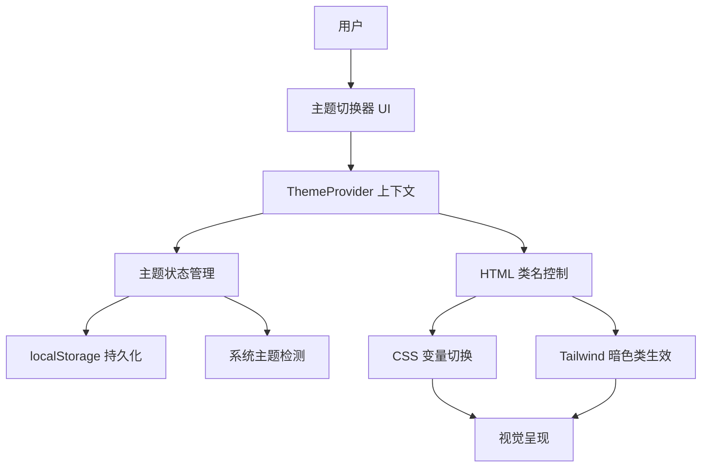
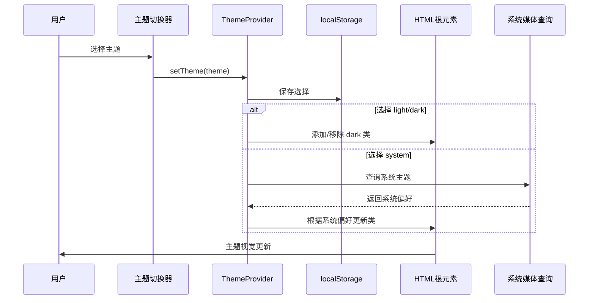
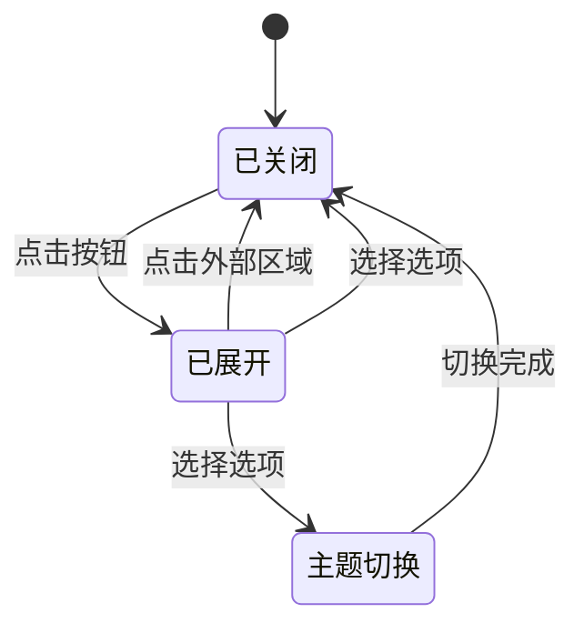

# CloudNetSpy 深色主题系统设计

## 设计目标

构建一套科技感、简约、深色、美观、极致的主题系统，支持用户自由切换浅色/深色模式，解决长时间使用的视觉疲劳问题，提升产品专业性和现代感。

## 核心价值

- 提供视觉舒适的深色模式，保护用户眼睛，减少长时间使用的疲劳感
- 提升产品的专业性和科技感，增强品牌形象
- 支持用户个性化偏好，状态持久化记忆
- 建立完整、可扩展的主题架构，便于未来维护和扩展

## 技术现状分析

### 当前技术栈
- React 19.2.0
- Tailwind CSS 4.1.18
- TypeScript 5.9.3
- Vite 7.2.4

### 现有主题基础

应用已具备基础的主题变量定义：

**CSS 变量体系**：
- 浅色主题变量已定义在 `:root` 选择器下
- 深色主题变量已定义在 `.dark` 类选择器下
- 使用 HSL 色彩空间定义所有颜色
- 包含完整的语义化颜色变量（background、foreground、primary、secondary、muted、accent、destructive、border、input、ring）

**现有问题**：
- 深色主题虽已定义，但缺少触发机制（无法应用 `.dark` 类）
- 组件层面存在大量硬编码颜色类名，未使用语义化变量
- 文章内容样式完全硬编码，无暗色适配
- 缺少主题切换控制器和状态管理
- 缺少主题偏好持久化机制

### 硬编码颜色问题统计

**严重区域**（需优先改造）：
1. **组件库**：Card、Badge、Button 使用硬编码背景色和文字色
2. **文章样式**：article.css 完全硬编码 `#333`、`#1a1a1a` 等颜色
3. **页面组件**：UpdateDetail、Updates 大量使用 `text-gray-*`、`bg-gray-*`、`text-green-*` 等固定色值
4. **布局组件**：Header 使用固定白色背景和固定文字色

**影响范围估算**：
- 需要改造的组件：约 15-20 个
- 需要调整的样式文件：3 个（index.css、article.css、各组件）
- 涉及的颜色类名：约 200+ 处

## 主题系统架构设计

### 整体架构



### 核心组件设计

#### ThemeProvider 上下文提供者

**职责**：
- 管理全局主题状态（light / dark / system）
- 提供主题切换方法
- 处理主题状态持久化
- 监听系统主题变化
- 控制 HTML 根元素的 `dark` 类名

**状态定义**：
| 状态名 | 类型 | 说明 |
|--------|------|------|
| theme | 'light' \| 'dark' \| 'system' | 用户选择的主题模式 |
| effectiveTheme | 'light' \| 'dark' | 实际生效的主题（system 模式时根据系统决定） |

**核心方法**：
| 方法名 | 参数 | 返回值 | 说明 |
|--------|------|--------|------|
| setTheme | theme: 'light' \| 'dark' \| 'system' | void | 切换主题并持久化 |
| getSystemTheme | - | 'light' \| 'dark' | 获取系统偏好主题 |

**行为流程**：



**初始化逻辑**：
1. 读取 localStorage 中保存的主题选择
2. 若无保存值，默认使用 'system' 模式
3. 若选择 'system'，通过 `window.matchMedia('(prefers-color-scheme: dark)')` 检测系统主题
4. 根据最终主题决定是否在 `<html>` 添加 `dark` 类
5. 监听系统主题变化事件，动态响应

**持久化策略**：
- 存储键名：`cloudnetspy-theme`
- 存储内容：用户选择的主题模式字符串
- 读取时机：应用初始化
- 写入时机：用户切换主题

#### ThemeSwitcher 主题切换器

**位置**：Header 组件右侧区域

**交互形式**：图标按钮 + 下拉菜单

**视觉设计**：
- 按钮显示当前主题对应的图标（太阳/月亮/电脑）
- 点击展开下拉菜单，显示三个选项
- 当前选中项带勾选标记
- 悬停和激活状态视觉反馈

**选项列表**：
| 图标 | 标签 | 值 | 说明 |
|------|------|-----|------|
| Sun | 浅色模式 | light | 强制浅色主题 |
| Moon | 深色模式 | dark | 强制深色主题 |
| Monitor | 跟随系统 | system | 根据操作系统设置自动切换 |

**交互流程**：


### 颜色系统设计

#### 深色主题色彩方案优化

**设计原则**：
- 科技感：采用深蓝灰色调，避免纯黑
- 对比度：确保文字与背景对比度 ≥ 4.5:1（WCAG AA 标准）
- 层次感：通过不同深度的灰色建立视觉层级
- 品牌色保持：主题色保持科技蓝，确保品牌识别度
- 减少蓝光：背景色偏向暖灰，减少眼睛疲劳

**优化色值方案**：

| 变量名 | 浅色模式（HSL） | 深色模式优化（HSL） | 用途 |
|--------|----------------|-------------------|------|
| --background | 0 0% 100% | **220 15% 8%** | 页面主背景（深蓝灰） |
| --foreground | 222.2 84% 4.9% | **210 15% 92%** | 主要文字色 |
| --card | 0 0% 100% | **220 14% 11%** | 卡片背景（比主背景亮） |
| --card-foreground | 222.2 84% 4.9% | **210 15% 92%** | 卡片文字色 |
| --primary | 221.2 83.2% 53.3% | **217 91% 60%** | 主题蓝色（略微提亮） |
| --primary-foreground | 210 40% 98% | **220 15% 8%** | 主题色上的文字 |
| --secondary | 210 40% 96.1% | **220 13% 18%** | 次要元素背景 |
| --secondary-foreground | 222.2 47.4% 11.2% | **210 15% 92%** | 次要元素文字 |
| --muted | 210 40% 96.1% | **220 12% 16%** | 弱化背景 |
| --muted-foreground | 215.4 16.3% 46.9% | **215 15% 65%** | 弱化文字 |
| --accent | 210 40% 96.1% | **217 91% 60%** | 强调色 |
| --accent-foreground | 222.2 47.4% 11.2% | **220 15% 8%** | 强调色文字 |
| --border | 214.3 31.8% 91.4% | **220 13% 20%** | 边框色 |
| --input | 214.3 31.8% 91.4% | **220 13% 20%** | 输入框边框 |
| --ring | 221.2 83.2% 53.3% | **217 91% 60%** | 聚焦环颜色 |

**新增语义化变量**（用于解决硬编码问题）：

| 变量名 | 浅色模式 | 深色模式 | 用途 |
|--------|---------|---------|------|
| --text-primary | 222.2 47% 11% | 210 15% 92% | 标题、重要文字 |
| --text-secondary | 215 16% 47% | 215 15% 70% | 次要文字、说明 |
| --text-tertiary | 215 10% 60% | 215 10% 55% | 辅助文字、占位符 |
| --bg-elevated | 0 0% 100% | 220 14% 13% | 悬浮、弹出元素背景 |
| --bg-hover | 210 40% 98% | 220 13% 15% | 悬停状态背景 |
| --success | 142 71% 45% | 142 70% 50% | 成功状态色 |
| --success-foreground | 0 0% 100% | 220 15% 8% | 成功状态文字 |
| --warning | 38 92% 50% | 38 90% 55% | 警告状态色 |
| --warning-foreground | 0 0% 100% | 220 15% 8% | 警告状态文字 |

#### Tailwind 暗色适配策略

**使用 dark: 修饰符原则**：
- 所有固定颜色类名需添加对应的 `dark:` 变体
- 优先使用语义化变量，减少颜色类直接使用
- 渐变色、特殊效果需单独适配

**常见模式映射表**：

| 浅色类名 | 深色对应 | 说明 |
|---------|---------|------|
| bg-white | dark:bg-background | 白色背景 → 主题背景 |
| bg-gray-50 | dark:bg-muted | 浅灰背景 → 弱化背景 |
| bg-gray-100 | dark:bg-secondary | 灰色背景 → 次要背景 |
| text-gray-900 | dark:text-foreground | 深色文字 → 主题前景色 |
| text-gray-600 | dark:text-muted-foreground | 中灰文字 → 弱化前景色 |
| text-gray-500 | dark:text-tertiary | 浅灰文字 → 三级文字 |
| border-gray-200 | dark:border-border | 边框色 → 主题边框 |
| bg-blue-100 | dark:bg-blue-500/10 | 淡蓝背景 → 蓝色半透明 |
| text-blue-700 | dark:text-blue-400 | 蓝色文字 → 提亮蓝色 |
| bg-green-100 | dark:bg-green-500/10 | 淡绿背景 → 绿色半透明 |
| text-green-600 | dark:text-green-400 | 绿色文字 → 提亮绿色 |

### 组件改造方案

#### Card 组件改造

**改造前问题**：
- 硬编码 `bg-white` 背景色
- 缺少暗色模式适配

**改造方案**：
- 背景色改为 `bg-card dark:bg-card`（使用 CSS 变量）
- 文字色改为 `text-card-foreground dark:text-card-foreground`
- 边框使用 `border-border dark:border-border`
- 阴影在暗色模式下调整强度

**改造后效果**：
```
浅色模式：白色卡片，深色文字，浅灰边框，轻微阴影
深色模式：深色卡片，浅色文字，深色边框，柔和阴影
```

#### Badge 组件改造

**改造前问题**：
- 各变体硬编码固定颜色
- 无暗色适配

**改造方案**：
为每个变体添加 `dark:` 对应样式

| 变体 | 浅色样式 | 深色样式 |
|------|---------|---------|
| default | bg-blue-100 text-blue-800 | dark:bg-blue-500/10 dark:text-blue-400 |
| secondary | bg-gray-100 text-gray-800 | dark:bg-secondary dark:text-secondary-foreground |
| success | bg-green-100 text-green-800 | dark:bg-green-500/10 dark:text-green-400 |
| warning | bg-yellow-100 text-yellow-800 | dark:bg-yellow-500/10 dark:text-yellow-400 |
| destructive | bg-red-100 text-red-800 | dark:bg-red-500/10 dark:text-red-400 |
| outline | border-gray-200 text-gray-700 | dark:border-border dark:text-muted-foreground |

#### Button 组件改造

**改造方案**：

| 变体 | 浅色样式 | 深色样式 |
|------|---------|---------|
| default | bg-blue-600 text-white | dark:bg-primary dark:text-primary-foreground |
| destructive | bg-red-600 text-white | dark:bg-destructive dark:text-destructive-foreground |
| outline | border-gray-300 bg-white | dark:border-border dark:bg-transparent dark:text-foreground dark:hover:bg-accent |
| secondary | bg-gray-100 text-gray-900 | dark:bg-secondary dark:text-secondary-foreground |
| ghost | hover:bg-gray-100 | dark:hover:bg-accent dark:text-foreground |
| link | text-blue-600 | dark:text-primary |

#### Header 组件改造

**改造方案**：
- 背景：`bg-white/95` → `bg-white/95 dark:bg-background/95`
- 边框：`border-b` → `border-b border-border`
- Logo 文字：`text-gray-900` → `text-foreground`
- 导航链接：
  - 默认：`text-gray-600` → `text-muted-foreground`
  - 激活：`text-blue-600` → `text-primary`
  - 悬停：`hover:text-blue-600` → `hover:text-primary`

#### 文章内容样式改造

**改造方案**：
article.css 中所有硬编码颜色需使用 CSS 变量替换

**改造映射表**：

| 原始硬编码 | 替换为变量 | 深色模式效果 |
|-----------|-----------|------------|
| color: #333 | color: hsl(var(--text-primary)) | 自动切换为浅色文字 |
| color: #1a1a1a | color: hsl(var(--text-primary)) | 自动切换为浅色文字 |
| color: #555 | color: hsl(var(--text-secondary)) | 自动切换为次级浅色 |
| border-bottom: 1px solid #eee | border-bottom: 1px solid hsl(var(--border)) | 自动切换为深色边框 |

**关键样式调整**：
```
段落文字：使用 --text-primary
标题文字：使用 --text-primary
次级文字：使用 --text-secondary
边框线：使用 --border
代码块背景：使用 --muted
引用块背景：使用 --secondary
```

#### 页面组件批量改造

**UpdateDetail 页面**：
- 所有 `text-gray-XXX` 添加 `dark:` 对应
- 所有 `bg-gray-XXX` 添加 `dark:` 对应
- 状态色（绿色、蓝色、紫色）使用半透明方案
- AI 分析区域渐变色需适配暗色

**Updates 页面**：
- 卡片列表背景适配
- 所有徽章颜色适配
- 筛选器组件颜色适配
- 分页器组件颜色适配

**Dashboard 页面**：
- 图表组件颜色适配（需考虑 Recharts 主题）
- 统计卡片颜色适配
- 空状态组件颜色适配

### 特殊场景处理

#### 图表组件适配

**问题**：Recharts 图表颜色需单独配置

**方案**：
- 根据当前主题动态传递颜色配置
- 坐标轴颜色、网格线颜色、提示框背景色需适配
- 图表线条和柱状图颜色保持品牌色系

**配置示例**：
```
浅色模式：
- 坐标轴文字：#666
- 网格线：#f0f0f0
- 提示框背景：white

深色模式：
- 坐标轴文字：hsl(var(--muted-foreground))
- 网格线：hsl(var(--border))
- 提示框背景：hsl(var(--card))
```

#### 滚动条样式适配

**现状**：index.css 中已定义滚动条样式，但未适配暗色

**改造方案**：
- 轨道背景：浅色用 `--muted`，深色同样用 `--muted`（自动切换）
- 滑块颜色：浅色用 `--muted-foreground/0.3`，深色同样（自动适配）
- 悬停颜色：透明度提升到 0.5

**实现方式**：
```
已使用 CSS 变量，无需额外改动
变量会根据 .dark 类自动切换
```

#### 焦点环和辅助功能

**要求**：
- 确保焦点环在两种模式下都清晰可见
- 颜色对比度符合无障碍标准
- 键盘导航体验一致

**方案**：
- 焦点环颜色使用 `--ring` 变量（自动适配）
- 焦点环偏移保持一致
- 所有交互元素都保留焦点状态

## 实施路线图

### 第一阶段：基础设施搭建

**目标**：建立主题切换核心能力

**任务清单**：
1. 创建 ThemeProvider 上下文组件
2. 实现主题状态管理逻辑
3. 实现 localStorage 持久化
4. 实现系统主题检测和监听
5. 在应用根组件注入 ThemeProvider
6. 创建 ThemeSwitcher 切换器组件
7. 在 Header 集成 ThemeSwitcher

**验收标准**：
- 点击切换器可成功切换主题
- HTML 根元素 `dark` 类正确添加/移除
- 刷新页面主题选择被保留
- 系统主题变化时自动响应（system 模式下）

### 第二阶段：颜色系统优化

**目标**：优化深色主题色值，建立完整的语义化变量

**任务清单**：
1. 更新 index.css 中 `.dark` 选择器下的色值
2. 新增语义化 CSS 变量（--text-primary 等）
3. 验证所有颜色对比度符合 WCAG AA 标准
4. 调整滚动条样式（如需）

**验收标准**：
- 深色模式视觉舒适、科技感强
- 文字与背景对比度达标
- 无刺眼或过暗区域

### 第三阶段：组件库改造

**目标**：核心 UI 组件完全适配深色模式

**改造顺序**（按优先级）：
1. Card 组件
2. Badge 组件
3. Button 组件
4. Input 组件
5. Select 组件
6. Pagination 组件
7. Loading 组件
8. EmptyState 组件

**验收标准**：
- 每个组件在两种模式下视觉正确
- 无硬编码颜色残留
- 交互状态（悬停、激活、禁用）完整适配

### 第四阶段：布局和页面改造

**目标**：页面级组件和布局完整适配

**改造顺序**：
1. Header 组件
2. MainLayout 组件
3. article.css 文章样式
4. UpdateDetail 页面
5. Updates 页面
6. Dashboard 页面

**验收标准**：
- 所有页面在两种模式下完整适配
- 文章内容阅读舒适
- 无视觉割裂或适配遗漏

### 第五阶段：特殊场景和细节优化

**目标**：处理特殊组件，打磨细节体验

**任务清单**：
1. Recharts 图表组件颜色适配
2. 渐变色效果调优（AI 分析区域等）
3. 阴影效果调优
4. 过渡动画调优
5. 移动端适配验证
6. 浏览器兼容性验证

**验收标准**：
- 图表在深色模式下美观清晰
- 特效和动画自然流畅
- 无视觉细节缺陷
- 主流浏览器表现一致

### 第六阶段：测试和文档

**目标**：全面测试，输出使用文档

**任务清单**：
1. 全流程功能测试
2. 视觉一致性检查
3. 无障碍标准验证
4. 性能影响评估
5. 编写组件使用文档
6. 编写主题扩展指南

**验收标准**：
- 无功能缺陷
- 无视觉异常
- 符合 WCAG AA 标准
- 文档完整清晰

## 质量标准

### 视觉质量要求

**色彩对比度**：
- 正文文字与背景对比度 ≥ 4.5:1
- 大号文字（≥18pt）与背景对比度 ≥ 3:1
- UI 组件与背景对比度 ≥ 3:1

**色彩一致性**：
- 同一语义的元素颜色保持一致
- 品牌色在两种模式下保持识别度
- 状态色（成功、警告、错误）符合直觉

**视觉层次**：
- 通过颜色深浅建立清晰的层次关系
- 重要信息突出，次要信息弱化
- 避免过度使用高对比色造成视觉疲劳

### 技术质量要求

**代码规范**：
- 禁止新增硬编码颜色值
- 优先使用 CSS 变量
- Tailwind 类名必须包含 dark: 变体
- 组件内联样式需考虑主题适配

**性能要求**：
- 主题切换响应时间 < 100ms
- 首次渲染不闪烁
- 不影响现有页面加载性能

**可维护性**：
- 颜色定义集中管理
- 组件主题逻辑清晰
- 易于扩展新主题

### 用户体验要求

**流畅性**：
- 主题切换过程平滑无闪烁
- 所有元素同步切换
- 无延迟或卡顿感

**完整性**：
- 所有可见元素完整适配
- 无遗漏的白色或黑色区块
- 边界场景正确处理

**易用性**：
- 切换器位置显眼易找
- 当前主题状态清晰
- 跟随系统选项易于理解

## 风险与限制

### 潜在风险

| 风险项 | 严重程度 | 缓解措施 |
|--------|---------|---------|
| 遗漏硬编码颜色导致适配不彻底 | 高 | 使用工具扫描、逐组件验收、建立检查清单 |
| 第三方组件（如 Recharts）适配困难 | 中 | 提前调研官方暗色方案、准备降级方案 |
| 性能影响（CSS 变量计算开销） | 低 | 使用性能监控、必要时优化变量层级 |
| 浏览器兼容性问题 | 低 | 目标浏览器已支持 CSS 变量和 dark 类 |
| 主题切换导致布局抖动 | 中 | 确保切换前后尺寸一致、使用过渡动画 |

### 已知限制

**技术限制**：
- CSS 变量不支持 IE11（项目已不支持旧浏览器）
- 部分第三方库可能需要手动传递颜色配置

**设计限制**：
- 当前仅实现浅色/深色两种模式，未包含其他主题
- 颜色方案基于现有品牌色，不支持完全自定义

**范围限制**：
- 本期不包含主题编辑器功能
- 不包含多套深色主题变体
- 不包含动态主题色切换（仅黑白切换）

## 后续扩展方向

### 短期优化

**主题细化**：
- 提供多种深色主题预设（科技蓝、暖灰、冷灰等）
- 支持用户自定义强调色

**体验增强**：
- 主题切换时添加淡入淡出动画
- 提供主题预览功能
- 支持定时自动切换（如日落后自动深色）

**性能优化**：
- 优化 CSS 变量层级减少计算
- 使用 CSS Layers 管理主题样式优先级

### 长期规划

**主题市场**：
- 支持社区贡献主题
- 提供主题打包和分享机制

**高级定制**：
- 可视化主题编辑器
- 支持导入/导出主题配置
- 细粒度颜色调整

**智能适配**：
- 根据环境光传感器自动调节
- 根据阅读时间智能建议主题
- 学习用户习惯自动切换

## 附录

### 颜色对比度检测工具

建议使用以下工具验证颜色对比度：
- WebAIM Contrast Checker
- Chrome DevTools Lighthouse
- axe DevTools 浏览器插件

### 参考资源

**设计参考**：
- Material Design 深色主题指南
- Apple Human Interface Guidelines 深色模式
- GitHub 深色主题实现

**技术参考**：
- Tailwind CSS 深色模式文档
- CSS 变量最佳实践
- React Context API 文档

### 术语表

| 术语 | 定义 |
|------|------|
| 主题模式 | 用户选择的主题类型（light / dark / system） |
| 生效主题 | 实际应用的主题（light / dark） |
| 语义化变量 | 表达用途而非具体颜色的 CSS 变量（如 --foreground） |
| 硬编码颜色 | 直接写在代码中的固定颜色值（如 #333、text-gray-900） |
| 对比度 | 文字与背景之间的亮度差异比率 |
| WCAG | Web 内容无障碍指南（Web Content Accessibility Guidelines） |
